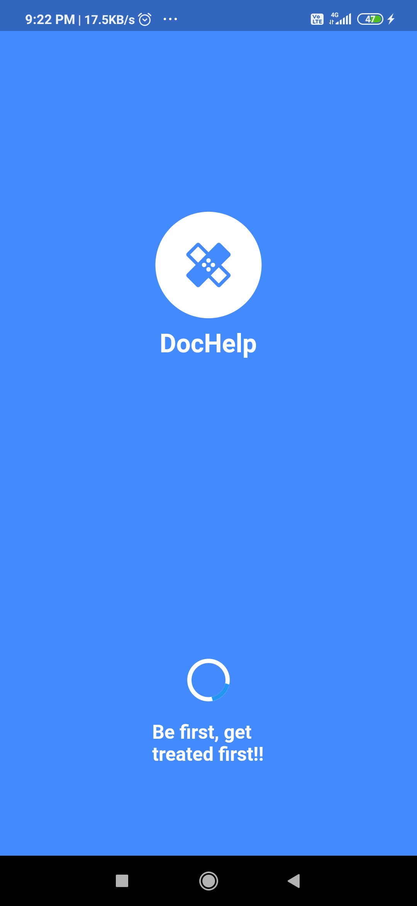

# DocHelp

A Flutter application for staff, patient and doctors.
Features-
1) Staff can add new patients. Is also able to update and delete the patient.
2) Doctor can view both online consultation patients and direct appointment patients.
3) Doctor and Patient can communicate via videocall and chat feature integrated in the app.
4) Payment Gateway integrated using RazorPay API.
5) Database-Firebase Firestore.
6) User authentication- Firebase Authentication

## Welcome Screen

## SignUp Staff Screen

## SignIn Staff Screen

## Patients list Screen

## Patient Details Screen

## Add Patient Screen

## Delete Patient Screen

## Staff Nav Drawer

## Staff Options

## Doctor SignIn Screen

## Online Patients List Screen

## Patient SignIn Screen

## Doctors List Screen

